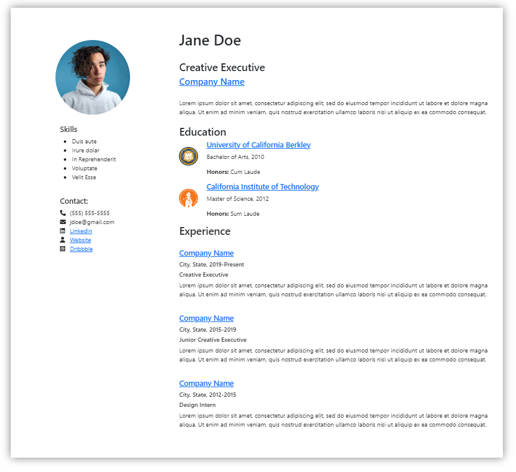
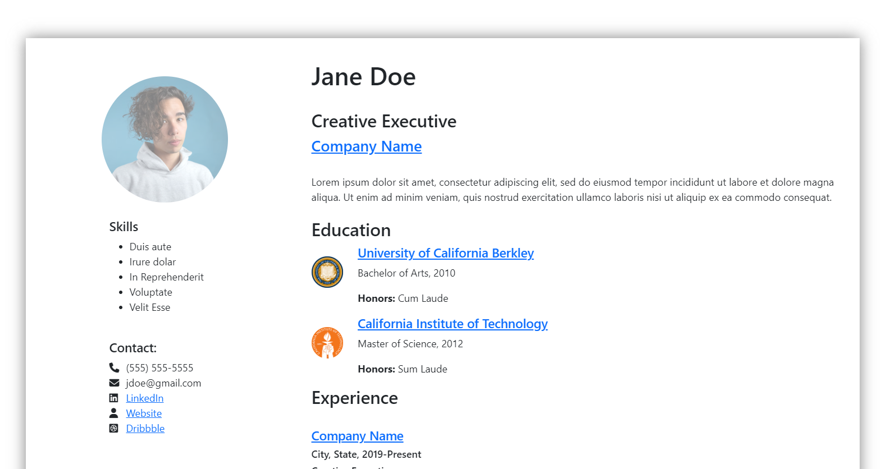

<h1 align="center">Daily-UI-06</h1>

<p align="center">
Another UI for <a href="https://www.dailyui.co/">Daily UI's</a> 100 Days of UI Challenge. 
The prompt was to create a user profile for any kind of site (e.g. professional, social, etc). 
</p>

## Links

- [Repo](https://github.com/kelseychristensen/Daily-UI-06.git "Daily-UI-06 Repo")
- [Dribbble](https://dribbble.com/shots/19998366-Daily-UI-Day-06-User-Profile "Daily-UI-06 Dribbble Snapshot")


## Screenshots




## Built With

- HTML
- CSS
- Bootstrap

## What went into this project

I opted to create a professional user profile for this project.

Once again, I used Bootstrap which definitely made laying something with this much content out much easier, 
and helped with the styling too. I opted not to mess around too much with the default colors
and fonts with Bootstraps. I think it makes sense for this use-case to have the style sort of 
resemble a lot of other big, popular sites on the web.

The result is definitely simple, but I think ultimately easy to read and well organized, 
while hitting on the big points. 


## What I Learned 

I learned I could use Bootstrap's layout structure using columns and rows to 
create layouts within layouts, e.g. rows with multiple columns within columns.

This is a super simple lesson, but I also learned that if I didn't apply
a background to the main container, a drop shadow effect would apply to 
all the items in the container, rather than the entire container itself. 
This stumped me for a few moments, at first.

## Continued Development

A bit more development would have to go into this project to make it responsive. A good mobile 
layout would look quite different than this one, for example. 

```html
    <div class="row"><div class="col-1"><i class="fa-solid fa-phone"></i></div><div class="col-11">(555) 555-5555</div></div>
        <div class="row"><div class="col-1"><i class="fa-solid fa-envelope"></i></div><div class="col-11">jdoe@gmail.com</div></div>
            <div class="row"><div class="col-1"><i class="fa-brands fa-linkedin"></i></div><div class="col-11"><a href="#">LinkedIn</a></div></div>
        <div class="row"><div class="col-1"><i class="fa-solid fa-user"></i></div><div class="col-11"><a href="#">Website</a></div></div>
        <div class="row"><div class="col-1"><i class="fa-brands fa-square-dribbble"></i></div><div class="col-11"><a href="#">Dribbble</a></div></div>

```
```css
.container {
   background: white;
   filter: drop-shadow(0 0 0.75rem gray);
   padding: 2%;
   margin: 5%;
}
```

## Author

Kelsey Christensen

- [Profile](https://github.com/kelseychristensen "Kelsey Christensen")
- [Email](mailto:kelsey.c.christensen@gmail.com?subject=Hi "Get in touch")
- [Dribble](https://dribbble.com/kelseychristensen "Dribbble")
- [Website](http://kelseychristensen.com/ "GitHub")

## Acknowledgments

The image comes from Unsplash. Thank you to Leio McLaren.
